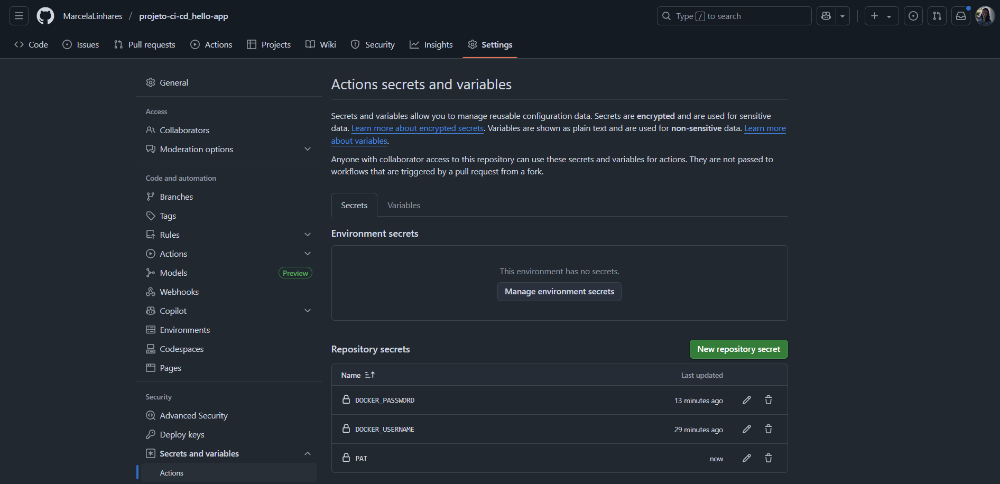

# Etapa 02 – Configurar o GitHub Actions (CI/CD)

Nesta etapa foi implementado o pipeline de **Integração e Entrega Contínua (CI/CD)** utilizando o GitHub Actions.

O objetivo principal foi automatizar o processo de:

- Build e push da imagem Docker da aplicação FastAPI no Docker Hub
- Atualização do arquivo `deployment.yaml` no repositório de manifests
- Criação automática de um Pull Request no repositório monitorado pelo ArgoCD

---

## 1. Estrutura do workflow

O arquivo do GitHub Actions foi criado no seguinte caminho dentro do repositório da aplicação:

`.github/workflows/ci-cd.yml`

### 🔹 Resumo do que faz o pipeline:

- O pipeline é executado automaticamente em todo `push`
- Ele realiza login no Docker Hub com os segredos definidos
- Constrói a imagem e faz push com duas tags (`latest` e o SHA do commit)
- Clona o repositório de manifests
- Altera o valor da imagem no `deployment.yaml`
- Cria um Pull Request automático com a atualização da tag

---

## 2. Conteúdo do arquivo `ci-cd.yaml`

```yaml
name: CI/CD

on:
  push:

jobs:
  build-and-deploy:
    runs-on: ubuntu-latest

    steps:
      - name: Checkout do código da aplicação
        uses: actions/checkout@v4

      - name: Login no Docker Hub
        uses: docker/login-action@v3
        with:
          username: ${{ secrets.DOCKER_USERNAME }}
          password: ${{ secrets.DOCKER_PASSWORD }}

      - name: Build e push da imagem Docker
        uses: docker/build-push-action@v5
        with:
          context: .
          push: true
          tags: |
            ${{ secrets.DOCKER_USERNAME }}/hello-app:latest
            ${{ secrets.DOCKER_USERNAME }}/hello-app:${{ github.sha }}

      - name: Clonar repositório de manifests (ArgoCD)
        uses: actions/checkout@v4
        with:
          repository: MarcelaLinhares/projeto-ci-cd_manifests
          token: ${{ secrets.PAT }}
          path: projeto-ci-cd_manifests

      - name: Atualizar a tag da imagem no arquivo deployment.yaml
        run: |
          cd projeto-ci-cd_manifests
          sed -i "s|image: .*/hello-app:.*|image: ${{ secrets.DOCKER_USERNAME }}/hello-app:${{ github.sha }}|g" deployment.yaml
          git config user.name "GitHub Actions"
          git config user.email "actions@github.com"
          git add deployment.yaml
          git commit -m "Atualizando a imagem hello-app para ${{ github.sha }} !!" || echo "Sem alterações!!"

      - name: Criar Pull Request para atualização do manifesto
        uses: peter-evans/create-pull-request@v6
        with:
          token: ${{ secrets.PAT }}
          commit-message: "Atualizar imagem hello-app para ${{ github.sha }}"
          title: "Atualizar imagem hello-app para ${{ github.sha }}"
          body: "Este PR atualiza a tag da imagem Docker da aplicação no manifesto Kubernetes!!"
          branch: update-hello-app-${{ github.sha }}
          base: main
          delete-branch: true
          path: projeto-ci-cd_manifests
```

🔗 **Link direto para o arquivo de workflow: [ci-cd.yaml](https://github.com/MarcelaLinhares/projeto-ci-cd_hello-app/blob/main/.github/workflows/ci-cd.yaml)**

## 3. Segredos criados no GitHub

Foram definidos os seguintes segredos em:

**Settings → Secrets and variables → Actions → Repository secrets**

| Nome               | Valor                                                                 |
|--------------------|------------------------------------------------------------------------|
| `DOCKER_USERNAME`  | Nome de usuário do Docker Hub                 |
| `DOCKER_PASSWORD`  | Senha do Docker Hub                                                    |
| `PAT`              | Personal Access Token (Classic) com permissão de escrita no repositório dos manifests |

📸 **Print de referência da tela dos secrets (valores ocultos):**



---

### 🔐 Como gerar o Personal Access Token (PAT)

O token `PAT` (Personal Access Token) é necessário para que o GitHub Actions consiga atualizar automaticamente o repositório dos manifests, criando um Pull Request.

> O tipo correto de token a ser usado é o **Personal Access Token (Classic)**.

#### ✅ Passo a passo para gerar o PAT:

1. Acesse: [https://github.com/settings/tokens](https://github.com/settings/tokens)

2. Clique no botão verde **“Generate new token (classic)”**

3. Preencha as informações:

- **Note (nome):** `ci-cd-github-actions`
- **Expiration:** selecione uma data ou deixe como **“No expiration”**
- **Scopes (permissões):** marque apenas:
  - ✅ `repo` → Garante permissões de leitura e escrita nos seus repositórios

4. Clique em **“Generate token”**

5. Copie o token gerado **(você só verá uma vez)** e adicione no repositório da aplicação como segredo com o nome:
`PAT`

> Esse token permitirá que o GitHub Actions realize commits e crie Pull Requests automaticamente no repositório `projeto-ci-cd_manifests`.

---

## ✅ Conclusão da Etapa

Com o pipeline configurado, qualquer push no repositório da aplicação irá:

- Publicar uma nova imagem no Docker Hub com tag exclusiva (`github.sha`)
- Atualizar automaticamente o arquivo `deployment.yaml` com a nova tag
- Criar um Pull Request no repositório de manifests monitorado pelo ArgoCD

---

### **[🔙 Voltar - Etapa 01](etapas-readmes/etapa-01-fastapi-dockerfile.md) | [➡️ Avançar - Etapa 03](etapas-readmes/etapa-03-manifests.md)**