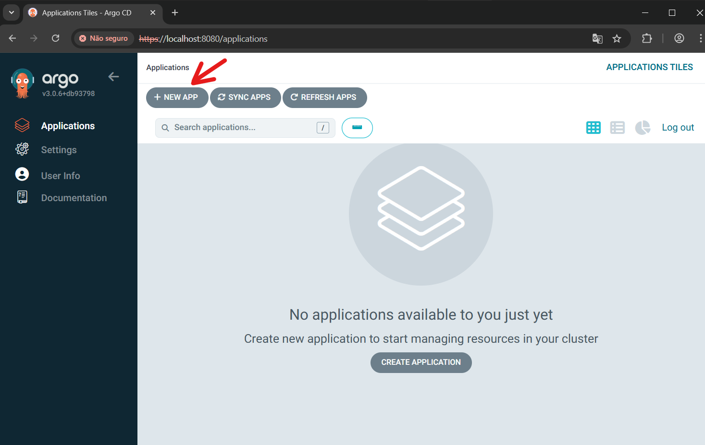
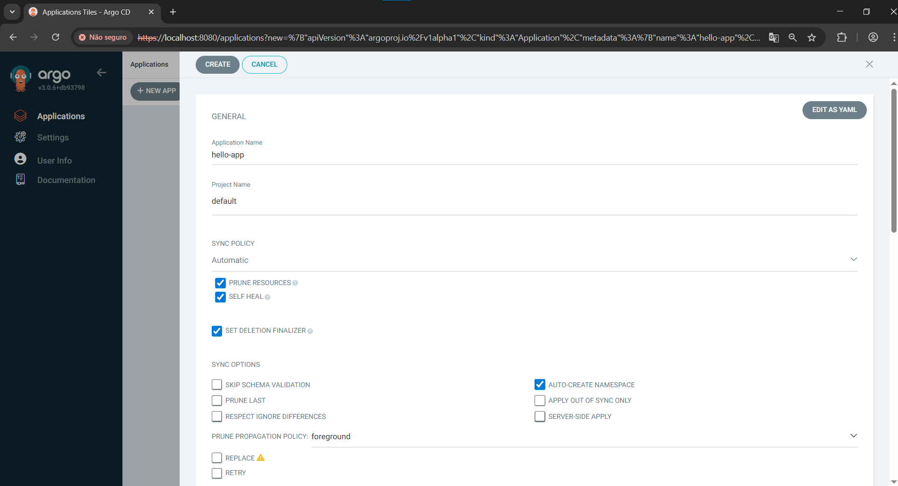
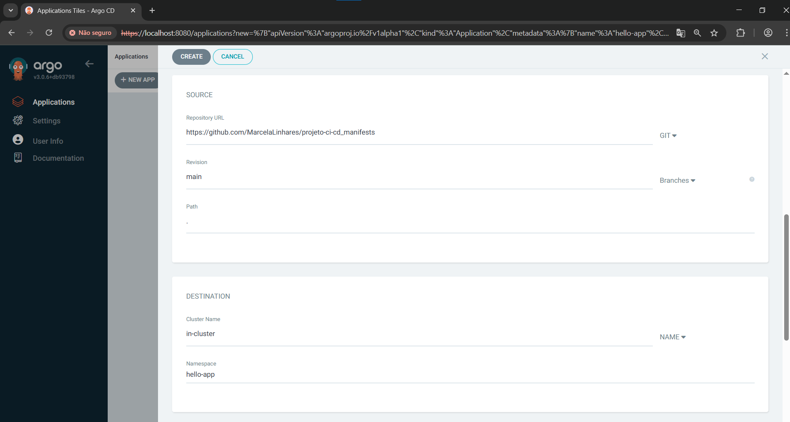
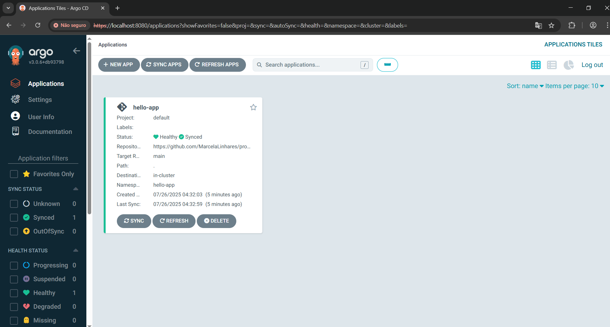
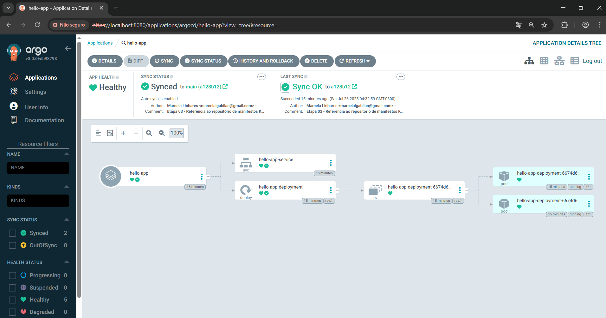

# Etapa 04 – Integração com o ArgoCD

Nesta etapa foi realizada a criação da aplicação no ArgoCD, responsável por monitorar o repositório de manifests e aplicar as alterações automaticamente no cluster Kubernetes local.

---

## 1. Instalação do ArgoCD (caso ainda não esteja instalado)

> Se você já instalou o ArgoCD anteriormente no seu ambiente, pode pular esta etapa.

Execute os comandos abaixo no terminal do Ubuntu (WSL2):

```bash
kubectl create namespace argocd
```
```bash
kubectl apply -n argocd -f https://raw.githubusercontent.com/argoproj/argo-cd/stable/manifests/install.yaml
```

## 2. Acesso ao painel do ArgoCD (via port-forward)

Para acessar o painel web do ArgoCD, faça o redirecionamento da porta `8080` para o serviço interno argocd-server:

```bash
kubectl port-forward svc/argocd-server -n argocd 8080:443
```

Acesse o painel pelo navegador no endereço:

```arduino
https://localhost:8080
```

> Como o ArgoCD utiliza HTTPS por padrão, pode ser necessário aceitar o risco de segurança no navegador ao acessar `localhost`.

## 3. Obter as credenciais de acesso

Usuário padrão: `admin`

Senha: utilize o comando abaixo para obter a senha gerada automaticamente:

```bash
kubectl -n argocd get secret argocd-initial-admin-secret -o jsonpath="{.data.password}" | base64 --decode && echo
```

> A senha será exibida no terminal. Use-a para fazer login no painel.

## 4. Criação do App no ArgoCD

Após acessar o painel do ArgoCD com o usuário e senha:

1. Clique em **“Applications”** no menu lateral

2. Clique no botão **“+ New App”** no canto superior esquerdo



3. Preencha os campos iniciais da aplicação:

- Application Name: `hello-app`

- Project: `default`

- Habilitar:

  - ✅ Sync Policy → Automatic

  - ✅ Prune Resources

  - ✅ Self Heal

  - ✅ Set Deletion Finalizer

  - ✅ Auto-Create Namespace



4. Na parte inferior da tela, preencha os dados do repositório:

- Repository URL: https://github.com/MarcelaLinhares/projeto-ci-cd_manifests

- Revision: `main`

- Path: `.` (ponto, pois os arquivos estão na raiz)

- Cluster Name: `in-cluster`

- Namespace: `hello-app`



5. Clique em Create.

## 5. Aplicação sincronizada

Após a criação, o ArgoCD fará a sincronização automaticamente. Aguarde alguns segundos e verifique o status.

Os principais status visuais que indicam sucesso na sincronização são:

- 💚 **Healthy** – Indica que os recursos (como Pods e Services) estão funcionando como esperado.
- ✅ **Synced** – Indica que o ArgoCD aplicou corretamente os manifests no cluster.

> 🔄 Durante o processo, o status poderá aparecer como `Progressing`, o que significa que o Kubernetes ainda está criando os recursos. Esse estado é temporário.




---

## ✅ Conclusão da Etapa

O App foi criado e sincronizado com sucesso no ArgoCD, monitorando o repositório de manifests.
A partir de agora, qualquer atualização no repositório `projeto-ci-cd_manifests` será aplicada automaticamente no cluster Kubernetes.

---

### **[🔙 Voltar - Etapa 03](etapa-03-manifests.md) | [➡️ Avançar - Etapa 05](etapa-05-teste-final.md)**