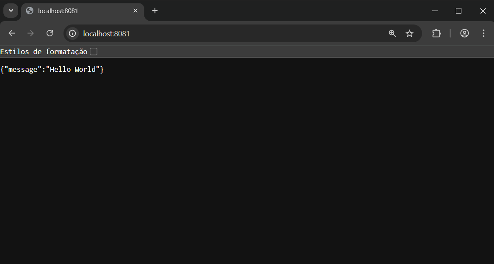
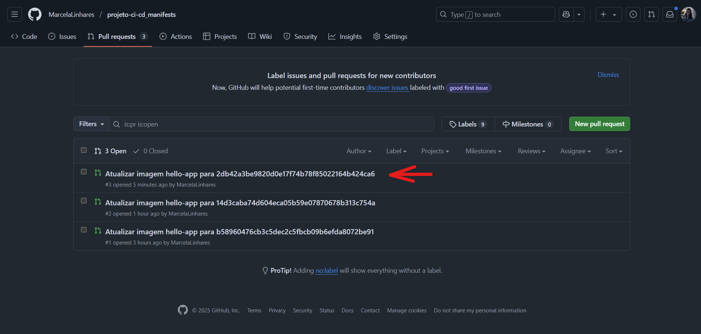
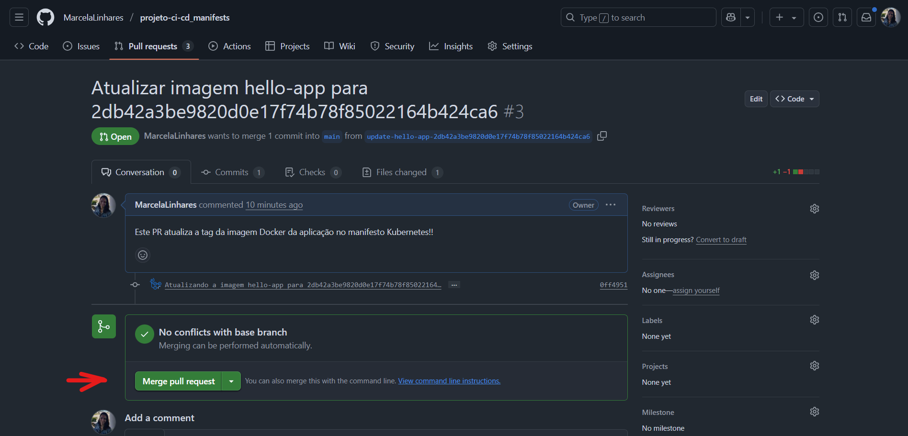
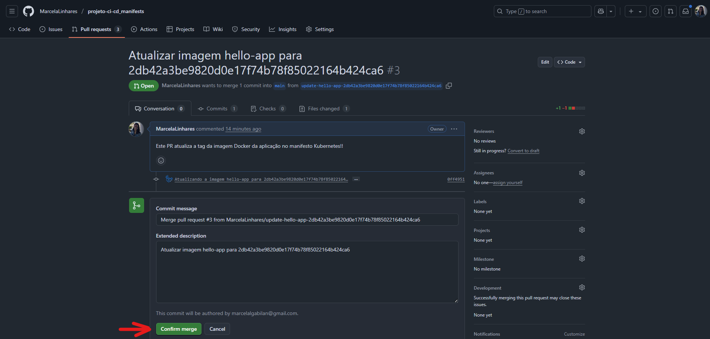
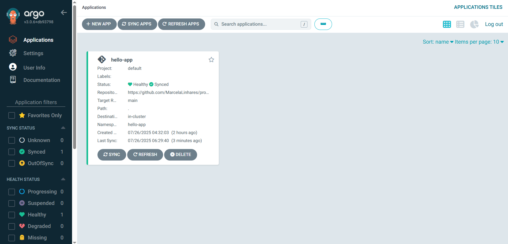

# Etapa 05 – Testes de Deploy e Atualização Automática

Nesta última etapa, foram realizados os testes finais para validar a integração completa entre os repositórios, a pipeline CI/CD e o deploy no Kubernetes via ArgoCD.

---

## 1. Acessar a aplicação via port-forward

Execute o comando abaixo em um terminal para fazer o redirecionamento de portas com `port-forward` e expor a aplicação na porta `8081` da sua máquina local (evitando conflito com o ArgoCD):

```bash
kubectl port-forward svc/hello-app-service 8081:80 -n hello-app
```

Depois, acesse a aplicação pelo navegador ou via terminal:

```arduino
http://localhost:8081/
```

📸 **Print de acesso à aplicação original:**



## 2. Alterar o conteúdo da aplicação

- Modifique o conteúdo do arquivo `main.py` no repositório da aplicação.

- Troque a mensagem de `"Hello World"` por outra qualquer.

Exemplo:

```python
from fastapi import FastAPI

app = FastAPI()

@app.get("/")
async def root():
    return {"message": "Nova mensagem! Deploy automatizado com sucesso!"}
```

🔗 **Link direto para o arquivo: [main.py](https://github.com/MarcelaLinhares/projeto-ci-cd_hello-app/blob/main/main.py)**

Em seguida:

1. Faça o commit da alteração:

```bash
git add .
git commit -m "Alterar mensagem para testar pipeline CI/CD"
git push origin main
```

2. O GitHub Actions será disparado automaticamente e executará:

- build da nova imagem

- push no Docker Hub

- alteração da tag no `deployment.yaml` do repositório de manifests

- criação de um Pull Request

📸 **Print do novo PR criado automaticamente:**



## 3. Mesclar o Pull Request criado

Acesse o repositório `projeto-ci-cd_manifests`, vá até a aba **Pull Requests** e clique no PR gerado automaticamente.

Depois, clique no botão **Merge** para aplicar as alterações na branch principal `main`.

📸 **Print do botão de merge:**



## 4. Verificar sincronização no ArgoCD

Após a mesclagem do PR, o ArgoCD fará a sincronização automática com o novo `deployment.yaml`.

📸 **Print do ArgoCD com novo deploy sincronizado:**



## 5. Validar atualização da aplicação

Acesse novamente a aplicação usando o mesmo comando de port-forward:

```bash
ubectl port-forward svc/hello-app-service 8081:80 -n hello-app
```

Depois, acesse:

```arduino
http://localhost:8081/
```

A nova mensagem deverá ser exibida.

📸 **Print da nova mensagem exibida:**


## 6. Verificar pods ativos no cluster

Para confirmar que a aplicação está rodando corretamente no Kubernetes, execute:

```bash
kubectl get pods -n hello-app
```

📸 **Print da listagem dos pods:**



---

## ✅ Conclusão da Etapa

Com a alteração da mensagem da aplicação, foi possível:

- Disparar a pipeline automaticamente

- Atualizar a imagem no Docker Hub

- Gerar e mesclar um Pull Request

- Ver a sincronização automática no ArgoCD

- Confirmar o novo deploy em execução no Kubernetes

✅ O ciclo completo de CI/CD com GitHub Actions, Docker, Kubernetes e ArgoCD foi validado com sucesso!

---

### **[🔙 Voltar - Etapa 04](etapa-04-argocd.md) | [🚀 Concluir Projeto - Retornar ao README Principal](https://github.com/MarcelaLinhares/projeto-ci-cd_hello-app)**